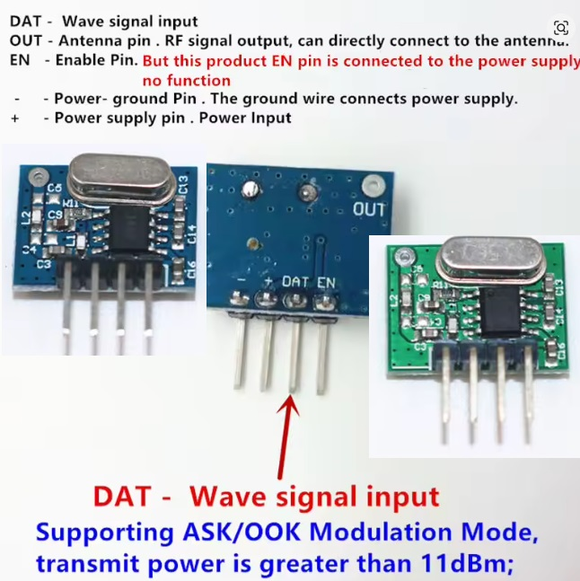

# HCS301_receiver
ESP32 S3 zero transmitter for HCS301 receiver
Simply connect 433MHz transmitter like this to pin 4 of ESP32.
This particular transmitter works on 3.3V. You can power it up from ESP 3.3V pin.

You can use the receiver project from here: https://github.com/vrgeorgiev/HCS301_receiver to copy the data from your heyfob/garage door remote and then paste the result in buff variable.
Upload the scetch to ESP and you can open your garage door with ESP.

